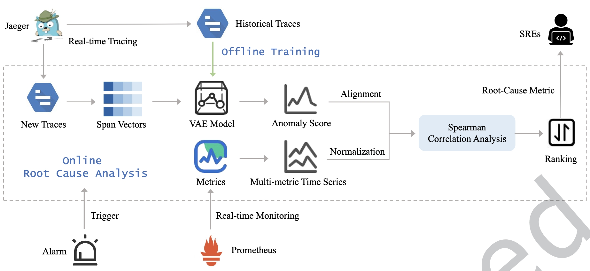

### HeMiRCA: Fine-Grained Root Cause Analysis for Microservices with Heterogeneous Data Sources

- 机构：港中文
- 会议：TOSEM 2024（CCF A）
- 类别：根因分析

#### 内容摘要

HeMiRCA 使用 Metric 和 Trace 两种数据，实现 Metric 级别的根因定位。HeMiRCA 通过分析微服务 Trace 的异常分数与 Metric 之间的单调相关性来识别根本原因。主要由 3 个组件组成：Span Vectors 构建、基于 VAE 的异常检测、基于 Spearman 相关系数的根因定位。

具体步骤
首先，提取 Trace 中的调用延迟来构建 Span Vectors。然后，使用无故障期间收集的数据离线训练 VAE 模型，使用在线 Trace 计算微服务的异常分数。之后，计算微服务的异常分数与多变量 Metric 时间序列之间的 Spearman 相关系数，对根因 Metric 进行排序，输出排序的根因 Metric 和微服务，使 SRE 能够快速解决故障，减少停机时间，提高整体系统性能。